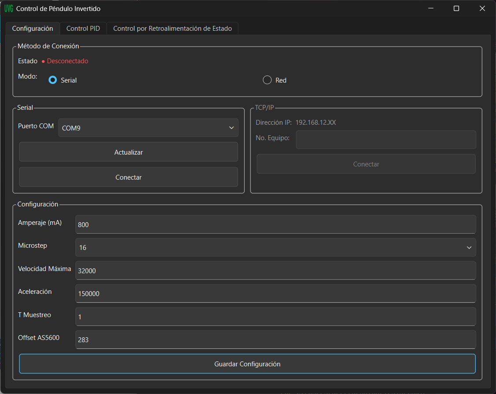
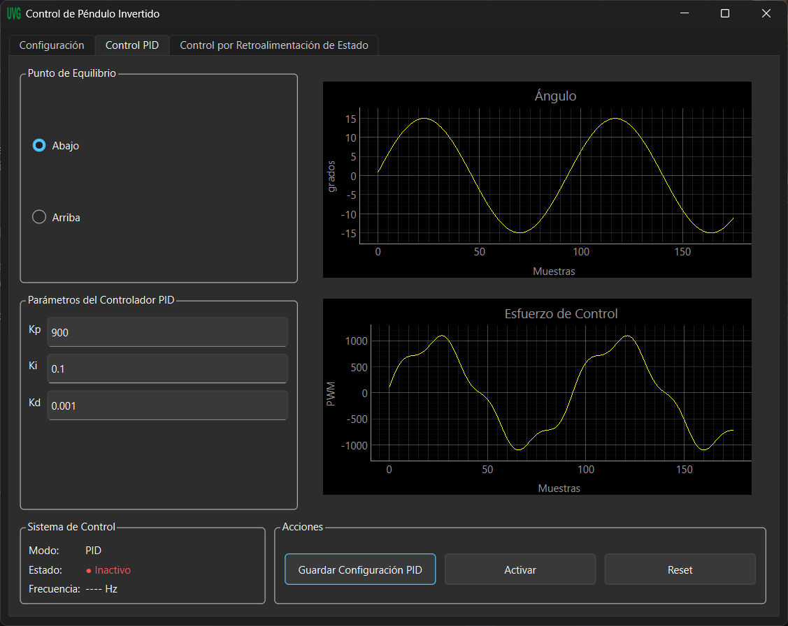

# Control de Péndulo Invertido — Interfaz Gráfica

Interfaz gráfica de escritorio para el acondicionamiento, configuración y control de un sistema de péndulo invertido, desarrollada como parte de un proyecto de graduación de la carrera de Ingeniería en la **Universidad del Valle de Guatemala**.

La aplicación permite establecer comunicación con un microcontrolador (ESP32) mediante **Serial** o **Red (TCP/IP)**, configurar los parámetros físicos del sistema, ajustar los controladores **PID** y **por retroalimentación de estado**, y visualizar en tiempo real las variables del péndulo mediante gráficas dinámicas.

---

## Tabla de contenidos

- [Autor](#autor)
- [Descripción del proyecto](#descripción-del-proyecto)
- [Capturas de pantalla](#capturas-de-pantalla)
- [Características principales](#características-principales)
- [Tecnologías utilizadas](#tecnologías-utilizadas)
- [Estructura del proyecto](#estructura-del-proyecto)
- [Requisitos previos](#requisitos-previos)
- [Instalación](#instalación)
- [Ejecución](#ejecución)
- [Uso de la interfaz](#uso-de-la-interfaz)
- [Estado del proyecto](#estado-del-proyecto)
- [Trabajo futuro](#trabajo-futuro)
- [Licencia](#licencia)

---

## Autor

**Anderson Daniel Eduardo Escobar Sandoval**
Carné: 21712
Universidad del Valle de Guatemala
Proyecto de graduación — Acondicionamiento de un sistema de péndulo invertido

---

## Descripción del proyecto

Este repositorio contiene el desarrollo de la interfaz gráfica (GUI) que forma parte del acondicionamiento de un sistema físico de péndulo invertido. La aplicación actúa como panel de control entre el usuario y el microcontrolador embebido, permitiendo:

- Establecer y gestionar la comunicación con el hardware.
- Configurar parámetros físicos y eléctricos del sistema (corriente del motor, microstepping, velocidad, aceleración, períodos de muestreo, calibración del sensor angular).
- Ajustar y aplicar las ganancias de dos estrategias de control distintas: **PID** y **retroalimentación de estado**.
- Visualizar en tiempo real el comportamiento del sistema mediante gráficas de las variables relevantes (ángulo, velocidad angular, posición y velocidad lineal).

---

## Capturas de pantalla

**Pestaña de Configuración** — selección del método de conexión (Serial/Red) y parámetros del sistema:



**Pestaña de Control PID** — ajuste de ganancias y visualización en tiempo real del ángulo y el esfuerzo de control:



---

## Características principales

- **Comunicación dual:** conexión vía puerto Serial (USB) o vía Red (TCP/IP), seleccionable desde la interfaz.
- **Configuración del sistema:** panel dedicado para parametrizar el driver del motor (amperaje, microstepping), la dinámica del movimiento (velocidad máxima, aceleración) y los períodos de control/telemetría, con validación de rangos permitidos.
- **Control PID:** configuración de ganancias Kp, Ki, Kd y selección del punto de equilibrio del péndulo (arriba/abajo).
- **Control por retroalimentación de estado:** configuración de las ganancias K1–K4 y de la posición de referencia del carro.
- **Visualización en tiempo real:** gráficas dinámicas para cada variable de interés, actualizadas conforme llegan los datos del microcontrolador.
- **Indicadores de estado:** retroalimentación visual del estado de conexión y del sistema de control (activo/inactivo).

---

## Tecnologías utilizadas

| Tecnología | Uso |
|---|---|
| [Python 3.x](https://www.python.org/) | Lenguaje principal del proyecto |
| [PySide6 (Qt for Python)](https://doc.qt.io/qtforpython-6/) | Construcción de la interfaz gráfica |
| [PyQtGraph](https://www.pyqtgraph.org/) | Graficación en tiempo real |
| [PySerial](https://pyserial.readthedocs.io/) | Comunicación por puerto serial |
| JSON | Formato de intercambio de datos con el microcontrolador |

---

## Estructura del proyecto

```
Interfaz/
├── main.py                        # Punto de entrada de la aplicación
├── ui/
│   ├── main_window.py             # Ventana principal (organiza las pestañas)
│   ├── config_tab.py              # Pestaña de configuración del sistema
│   ├── pid_tab.py                 # Pestaña de control PID
│   ├── state_tab.py               # Pestaña de control por retroalimentación de estado
│   ├── utils/
│   │   └── widget_style.py        # Funciones de estilo reutilizables para los widgets
│   └── constants/
│       └── ui_constants.py        # Constantes visuales (colores, tamaños, textos de estado)
├── comunicacion/
│   ├── connection_manager.py      # Gestor central de conexión (Serial/Red)
│   ├── serial_manager.py          # Comunicación vía puerto Serial
│   ├── tcp_manager.py             # Comunicación vía Red (TCP/IP) — en desarrollo
│   └── Serial_reader_thread.py    # Hilo de lectura continua del puerto serial
├── models/
│   ├── config_model.py            # Modelo de configuración general del sistema
│   ├── pid_model.py               # Modelo de configuración del controlador PID
│   └── state_model.py             # Modelo de las variables de estado del péndulo
├── plots/
│   ├── live_plot.py               # Widget base de gráfico en tiempo real
│   ├── pid_plots.py                # Gráficas de la pestaña PID
│   └── state_plots.py             # Gráficas de la pestaña de retroalimentación de estado
├── resources/                     # Íconos e imágenes de la aplicación
├── .gitignore
└── README.md
```

---

## Requisitos previos

- Python 3.10 o superior (recomendado)
- pip (gestor de paquetes de Python)
- Un microcontrolador ESP32 configurado con el firmware correspondiente al proyecto — *repositorio del firmware: pendiente de publicación*
- Cable USB (para modo Serial) o red local compartida entre el equipo y el ESP32 (para modo Red)

---

## Instalación

1. Clona este repositorio:
   ```bash
   git clone https://github.com/<usuario>/<nombre-repositorio>.git
   cd <nombre-repositorio>
   ```

2. Crea un entorno virtual (recomendado):
   ```bash
   python -m venv GUI_Lab
   ```

3. Activa el entorno virtual:
   - En Windows (PowerShell):
     ```powershell
     .\GUI_Lab\Scripts\Activate.ps1
     ```
   - En Linux/macOS:
     ```bash
     source GUI_Lab/bin/activate
     ```

4. Instala las dependencias:
   ```bash
   pip install -r requirements.txt
   ```

   El archivo `requirements.txt` incluye las siguientes dependencias:
   ```
   colorama==0.4.6
   numpy==2.4.6
   pyqtgraph==0.14.0
   pyserial==3.5
   PySide6==6.11.1
   PySide6_Addons==6.11.1
   PySide6_Essentials==6.11.1
   shiboken6==6.11.1
   ```

---

## Ejecución

Con el entorno virtual activado, ejecuta:

```bash
python main.py
```

Esto abrirá la ventana principal de la aplicación con las tres pestañas disponibles: **Configuración**, **Control PID** y **Control por Retroalimentación de Estado**.

---

## Uso de la interfaz

1. **Configuración:** selecciona el método de conexión (Serial o Red), conecta el sistema y define los parámetros físicos del motor y del sensor antes de operar el péndulo.
2. **Control PID:** ajusta las ganancias Kp, Ki y Kd, selecciona el punto de equilibrio deseado y guarda la configuración para enviarla al microcontrolador.
3. **Control por Retroalimentación de Estado:** define las ganancias K1–K4 y la posición de referencia del carro, y aplica la configuración al sistema.
4. En ambas pestañas de control, las gráficas en tiempo real permiten monitorear visualmente la respuesta del sistema tras aplicar los cambios.

---

## Estado del proyecto

🚧 **En desarrollo activo** — proyecto de graduación en curso.

- [x] Comunicación Serial funcional
- [ ] Comunicación por Red (TCP/IP) — actualmente en fase de implementación (placeholder)
- [x] Configuración general del sistema
- [x] Control PID (interfaz y envío de configuración)
- [x] Control por retroalimentación de estado (interfaz y envío de configuración)
- [x] Visualización en tiempo real de variables del sistema

---

## Trabajo futuro

- Implementación completa de la comunicación vía TCP/IP (actualmente en fase de prueba).
- Conexión de los botones "Activar" y "Reset" de las pestañas de control con la lógica de activación/desactivación del sistema.
- Registro histórico (logging) de datos para su posterior análisis.
- Pruebas de validación del sistema completo (hardware + software) bajo distintos escenarios de control.

---

## Licencia

Este proyecto se desarrolla como parte de un trabajo de graduación de la Universidad del Valle de Guatemala. El documento de tesis en sí es propiedad intelectual de la universidad; sin embargo, el **código fuente** de esta interfaz se distribuye bajo la licencia **MIT**, por lo que puede ser utilizado, modificado y redistribuido libremente citando la autoría original.

```
MIT License

Copyright (c) 2026 Anderson Daniel Eduardo Escobar Sandoval

Permission is hereby granted, free of charge, to any person obtaining a copy
of this software and associated documentation files (the "Software"), to deal
in the Software without restriction, including without limitation the rights
to use, copy, modify, merge, publish, distribute, sublicense, and/or sell
copies of the Software, and to permit persons to whom the Software is
furnished to do so, subject to the following conditions:

The above copyright notice and this permission notice shall be included in all
copies or substantial portions of the Software.

THE SOFTWARE IS PROVIDED "AS IS", WITHOUT WARRANTY OF ANY KIND, EXPRESS OR
IMPLIED, INCLUDING BUT NOT LIMITED TO THE WARRANTIES OF MERCHANTABILITY,
FITNESS FOR A PARTICULAR PURPOSE AND NONINFRINGEMENT. IN NO EVENT SHALL THE
AUTHORS OR COPYRIGHT HOLDERS BE LIABLE FOR ANY CLAIM, DAMAGES OR OTHER
LIABILITY, WHETHER IN AN ACTION OF CONTRACT, TORT OR OTHERWISE, ARISING FROM,
OUT OF OR IN CONNECTION WITH THE SOFTWARE OR THE USE OR OTHER DEALINGS IN THE
SOFTWARE.
```
